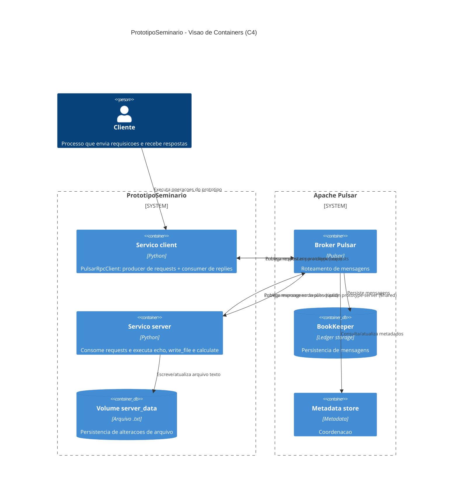
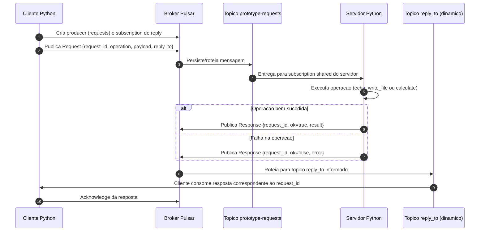

# Etapa 1: Estudo da Tecnologia e do Paradigma \- Apache Pulsar

Este documento apresenta o estudo fundamental para o seminário do Grupo 3, focado no Apache Pulsar como middleware para comunicação distribuída. O trabalho detalha a documentação da tecnologia, o paradigma de comunicação, exemplos práticos de uso e a análise técnica da arquitetura.

## 1\. Estudo da Documentação da Tecnologia (Apache Pulsar)

O **Apache Pulsar** é um sistema de mensageria e streaming distribuído, originalmente desenvolvido pelo **Yahoo** por volta de 2010 e doado à Apache Software Foundation em 2016\. Ele foi concebido para superar limitações de escalabilidade e confiabilidade em sistemas de grande escala, atuando como uma solução robusta para integração entre máquinas físicas heterogêneas.

Como middleware, o Pulsar resolve problemas críticos de comunicação distribuída, permitindo que diferentes aplicações troquem mensagens de forma assíncrona, executem cálculos distribuídos e alterem arquivos de maneira persistente. Sua principal característica é a capacidade de gerenciar fluxos de dados massivos com baixa latência, garantindo que a informação chegue ao destino mesmo em cenários de falhas de rede ou hardware.

| Característica | Descrição |
| :---- | :---- |
| **Origem** | Desenvolvido no Yahoo para suportar serviços como Yahoo Mail e Yahoo Finance. |
| **Objetivo** | Prover uma plataforma unificada para mensageria de alto desempenho e streaming de eventos. |
| **Escalabilidade** | Design nativo para nuvem (cloud-native) com separação entre computação e armazenamento. |

## 2\. Identificação do Paradigma de Comunicação

O paradigma central do Apache Pulsar fundamenta-se na **Mensageria e Streaming**, utilizando um **Middleware Orientado a Mensagens (MOM)**. Este modelo permite a troca de informações de forma assíncrona e persistente, essencial para sistemas distribuídos modernos.

O estilo de interação predominante é o **Publish-Subscribe (Pub/Sub)**, que promove o **acoplamento fraco** entre as aplicações. Este desacoplamento é manifestado em duas dimensões principais:

"O desacoplamento no **tempo** garante que o receptor não precise estar ativo no momento do envio, enquanto o desacoplamento no **espaço** permite que os processos operem sem conhecer a localização física ou identificadores uns dos outros."

Esta abordagem facilita a manutenção e a evolução do sistema, pois componentes podem ser adicionados, removidos ou atualizados sem impactar o funcionamento global da arquitetura.

## 3\. Levantamento de Exemplos de Uso

Sistemas de mensageria como o Pulsar são a espinha dorsal de operações críticas em diversos setores. Abaixo, destacam-se os principais cenários de aplicação:

### Cenário 1: Divulgação Automática de Oportunidades de Investimento

Este é o foco prático do Grupo 3\. O Apache Pulsar gerencia o fluxo de alertas em tempo real para milhares de clientes simultaneamente. Quando uma nova oportunidade é detectada por um motor de análise, o Pulsar distribui essa informação instantaneamente para todos os assinantes interessados, garantindo que a latência seja mínima para operações financeiras sensíveis ao tempo.

### Integração de Aplicações Empresariais (EAI)

O middleware atua como um facilitador para conectar bases de dados dispersas e microsserviços. Ele simplifica a comunicação entre sistemas legados e aplicações modernas, permitindo que dados fluam de forma segura e consistente entre diferentes departamentos de uma organização.

### Outras Aplicações

- **Monitoramento de IoT:** Coleta e processamento de dados de milhões de dispositivos conectados.  
- **Sistemas de Cobrança e Pagamento:** Processamento confiável de transações financeiras com garantias de entrega de mensagens (Exactly-once processing).

## 4\. Análise da Arquitetura do Middleware

A arquitetura do Apache Pulsar é projetada para mascarar a heterogeneidade de rede, hardware e sistemas operacionais, funcionando como um **Message Broker** (gateway de mensagens) altamente eficiente.

### Camadas da Arquitetura

O Pulsar adota uma estrutura de camadas separadas, o que o diferencia de outros middlewares como o Apache Kafka:

1. **Camada de Serviço (Serving Layer):** Composta por **Brokers** sem estado (stateless). Eles são responsáveis por receber mensagens dos produtores, roteá-las e despachá-las para os consumidores. Por serem stateless, podem ser escalados horizontalmente com facilidade.  
2. **Camada de Armazenamento (Storage Layer):** Utiliza o **Apache BookKeeper** (Bookies). Esta camada garante a persistência das mensagens em logs distribuídos chamados *ledgers*. A separação permite que o armazenamento cresça independentemente da capacidade de processamento.  
3. **Metadata Store:** Geralmente utiliza **ZooKeeper** para coordenação do cluster, gerenciamento de metadados e configuração.

### Componentes Principais

| Componente | Função |
| :---- | :---- |
| **Produtores** | Aplicações que publicam mensagens em tópicos específicos. |
| **Consumidores** | Aplicações que assinam tópicos para processar as mensagens recebidas. |
| **Tópicos** | Canais lógicos de comunicação onde as mensagens são organizadas. |
| **Assinaturas (Subscriptions)** | Definem como as mensagens são entregues aos consumidores (ex: exclusiva, compartilhada, failover). |

### Diagrama de componentes (protótipo e middleware)

O diagrama a seguir representa o cenário real do **PrototipoSeminario** no Docker Compose, com os serviços `pulsar`, `server` e `client`, os tópicos usados no request/reply e os artefatos de persistência.



### Diagrama de sequencia (fluxo request/response no prototipo)



## 5\. Fundamentação Teórica e Conclusão

A escolha do Apache Pulsar para sistemas que exigem **alta escalabilidade e confiabilidade** justifica-se por sua arquitetura multi-camada e suporte nativo a multi-tenancy. Ele oferece vantagens competitivas como a geo-replicação integrada e a capacidade de lidar com milhões de tópicos individuais sem perda de desempenho.

Apesar de sua complexidade operacional inicial, as bibliotecas suportadas (Java, Python, Go, C++, etc.) facilitam a adoção por desenvolvedores, tornando-o uma ferramenta indispensável para a engenharia de sistemas distribuídos contemporânea.

## 6\. Avaliação e Demonstração do Protótipo

Esta seção consolida o mapeamento técnico do protótipo e define como validar seu funcionamento para a demonstração no seminário.

### 6.1 Mapeamento de tópicos e componentes no código

| Elemento | Identificação no protótipo | Arquivo |
| :---- | :---- | :---- |
| **Tópico de request (fixo)** | `persistent://public/default/prototype-requests` | `client.py` e `server.py` |
| **Tópico de response (dinâmico)** | `persistent://public/default/replies-<uuid>` | `client.py` |
| **Componente Cliente** | Classe `PulsarRpcClient` | `client.py` |
| **Componente Servidor** | Processo `main()` (consumidor + produtor) | `server.py` |
| **Contrato de request** | Classe `Request` | `protocol.py` |
| **Contrato de response** | Classe `Response` | `protocol.py` |
| **Subscription do servidor** | `prototype-server` com tipo `Shared` | `server.py` |
| **Subscription do cliente** | `client-<uuid>` | `client.py` |

### 6.2 Como validar o funcionamento do protótipo

A validação deve comprovar os requisitos obrigatórios: resposta a texto, alteração de arquivo no servidor e cálculo de função.

**Passo 1: subir broker e servidor**

```powershell
docker compose --profile server up --build
```

**Passo 2: executar cliente para cada operação**

1. **Mensagem de texto**

```powershell
docker compose --profile client run --rm client python -m prototype.client echo --text "Teste de conectividade"
```

Validação esperada:
- retorno `ok: true`;
- campo `result.message` contendo o texto enviado.

2. **Alteração de arquivo texto no servidor**

```powershell
docker compose --profile client run --rm client python -m prototype.client write_file --filename registro.txt --content "Linha de validacao" --mode append
```

Validação esperada:
- retorno `ok: true`;
- `result.filename` igual a `registro.txt`;
- `result.preview` contendo a linha adicionada.

3. **Cálculo de função**

```powershell
docker compose --profile client run --rm client python -m prototype.client calculate --function multiply --args 6 7
```

Validação esperada:
- retorno `ok: true`;
- `result.function` igual a `multiply`;
- `result.result` igual a `42`.

### 6.3 Testes executados (resultado real)

Os testes abaixo foram executados com o ambiente Docker ativo e serviços do `docker-compose.yml`.

| ID | Teste | Comando | Resultado | Status |
| :-- | :-- | :-- | :-- | :-- |
| T1 | Echo | `python -m prototype.client echo --text "Teste E2E: conectividade"` | `ok=true` e mensagem retornada | PASS |
| T2 | Write file | `python -m prototype.client write_file --filename registro_e2e.txt --content "Linha de validacao E2E" --mode append` | `ok=true`, bytes=23 e preview esperado | PASS |
| T3 | Calculate | `python -m prototype.client calculate --function multiply --args 6 7` | `ok=true` e resultado `42` | PASS |
| T4 | Erro controlado | `python -m prototype.client calculate --function invalida --args 1 2` | `ok=false` com mensagem de função desconhecida | PASS |
| T5 | Persistência | leitura de `server_data/registro_e2e.txt` | conteúdo `Linha de validacao E2E` | PASS |

> Relatório completo de execução: `RESULTADO_TESTES_E2E.md`

### 6.4 Evidências para o seminário (prints e logs)

Para registrar evidências técnicas de execução, os seguintes prints textuais do terminal e logs foram coletados.

**Print 1 - infraestrutura pronta**

```text
Client:
 Version:           20.10.23
Server: Docker Desktop 4.17.0 (99724)
 Engine:
  Version:          20.10.23
CONTAINER ID   IMAGE     COMMAND   CREATED   STATUS    PORTS     NAMES
```

**Print 2 - retorno do cliente (`echo`)**

```json
{
  "request_id": "1e3c60d0c0834751bebafa4129599f88",
  "ok": true,
  "result": {
    "message": "Servidor recebeu: Teste E2E: conectividade"
  },
  "error": null
}
```

**Print 3 - retorno do cliente (`write_file`)**

```json
{
  "request_id": "74590c1196984ed8b0f6d3e624f175d0",
  "ok": true,
  "result": {
    "filename": "registro_e2e.txt",
    "path": "/data/registro_e2e.txt",
    "bytes": 23,
    "preview": "Linha de validacao E2E\n"
  },
  "error": null
}
```

**Print 4 - retorno do cliente (`calculate`)**

```json
{
  "request_id": "4d3703fbed624f64a4d546f58b49eba9",
  "ok": true,
  "result": {
    "function": "multiply",
    "args": [6, 7],
    "result": 42
  },
  "error": null
}
```

**Print 5 - erro controlado**

```json
{
  "request_id": "7da01d2195ca42f8b6c679deeb3233bb",
  "ok": false,
  "result": null,
  "error": "Funcao desconhecida. Use add, subtract, multiply, divide, power, sqrt, factorial ou fibonacci."
}
```

**Log relevante do servidor (request_id e reply_to)**

```text
prototiposeminario-server-1  | Recebido echo id=1e3c60d0c0834751bebafa4129599f88 reply_to=persistent://public/default/replies-96e3575b3dba4b9bb1d9827744e84473
prototiposeminario-server-1  | Recebido write_file id=74590c1196984ed8b0f6d3e624f175d0 reply_to=persistent://public/default/replies-fd3ba5a3f8a34440b7f0fc6ba6744a33
prototiposeminario-server-1  | Recebido calculate id=4d3703fbed624f64a4d546f58b49eba9 reply_to=persistent://public/default/replies-7b228fa0c3b5419ba3e8ffee04098970
prototiposeminario-server-1  | Recebido calculate id=7da01d2195ca42f8b6c679deeb3233bb reply_to=persistent://public/default/replies-9f0343b7170b4a1499d1d4813bc4acf5
```

**Log relevante do broker (criação de tópico de resposta dinâmico)**

```text
prototiposeminario-pulsar-1  | Created topic persistent://public/default/replies-96e3575b3dba4b9bb1d9827744e84473 - dedup is disabled
prototiposeminario-pulsar-1  | Created topic persistent://public/default/replies-fd3ba5a3f8a34440b7f0fc6ba6744a33 - dedup is disabled
prototiposeminario-pulsar-1  | Created topic persistent://public/default/replies-7b228fa0c3b5419ba3e8ffee04098970 - dedup is disabled
```

- capturas de tela dos logs do servidor recebendo `operation`, `request_id` e `reply_to`;
- saída JSON do cliente para as três operações obrigatórias;
- evidência do arquivo alterado no volume do servidor (`server_data`);
- identificação do `PULSAR_URL` apontando para a máquina do broker (demonstração distribuída real).

### 6.5 Roteiro sugerido de demonstração (5 a 7 minutos)

1. Mostrar arquitetura resumida: cliente, broker Pulsar, servidor, tópicos e subscriptions.
2. Explicar o fluxo request/response usando o diagrama de sequência.
3. Executar operação `echo` e confirmar resposta.
4. Executar `write_file` e mostrar alteração persistida no servidor.
5. Executar `calculate` e validar o resultado retornado.
6. Encerrar destacando desacoplamento no tempo/espaço e aderência aos requisitos da disciplina.

### 6.6 Critérios de aceitação da demonstração

Considera-se a demonstração aprovada quando:

- as três operações obrigatórias funcionam sem intervenção manual no código;
- o cliente recebe respostas associadas ao `request_id` correto;
- há evidência de comunicação via tópicos Pulsar (não chamada direta entre processos);
- o cenário utiliza processos distribuídos em máquinas físicas distintas, conforme exigência da disciplina.